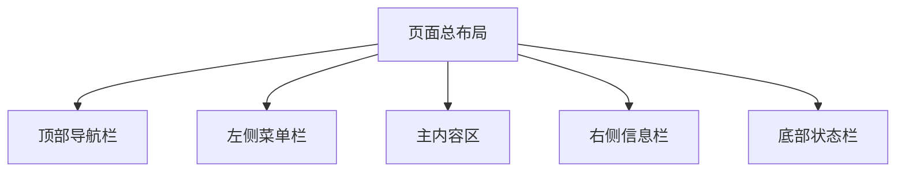
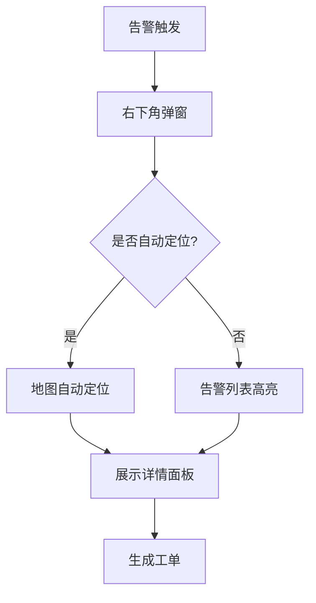
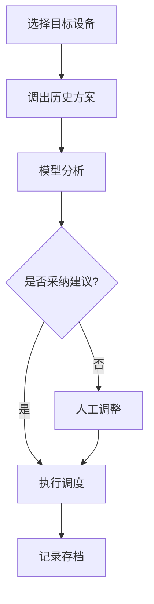

# 供水管网调度系统主页面设计文档

## 页面概述

本文档描述了供水管网调度系统的主页面设计，包括布局结构、交互逻辑和响应式适配方案。该系统面向多角色用户（管理决策层、调度人员、工程师等），需要满足不同层级的业务需求。

## 一、页面总体布局

### 布局结构图

### 1. 顶部导航栏

**位置与尺寸**
- 固定在页面顶部
- 高度: 60px
- 宽度: 100%

**内容元素**
- 左侧区域
  - 系统Logo
  - 系统名称
- 中部区域
  - 全局搜索框（支持快捷键 Ctrl+K）
- 右侧区域
  - 消息通知（支持未读消息红点）
  - 用户信息（头像+姓名）
  - 系统设置
  - 帮助中心

**交互特性**
- 消息中心：点击展开消息列表，支持标记已读
- 用户信息：点击展开个人中心下拉菜单
- 搜索框：支持多维度搜索（设备、工单、文档等）

### 2. 左侧菜单栏

**位置与尺寸**
- 固定在页面左侧
- 宽度：240px（展开）/ 60px（收起）
- 高度：100%（不含顶部导航）

**菜单结构**
- 一级菜单
  - 总览
  - 实时监控
  - 调度指挥
  - 模型管理
  - 数据分析
  - 报表中心
  - 系统设置
- 二级菜单（动态展示）

**交互特性**
- 支持展开/收起切换
- 当前页面菜单高亮
- 支持菜单收藏
- 根据用户角色动态显示

### 3. 主内容区

#### a) KPI指标卡片区

**布局特征**
- 响应式网格布局
- 卡片尺寸：300px × 150px
- 间距：20px

**核心指标**
- 供水总量
- 压力合格率
- 水质达标率
- 告警总数
- 工单处理率
- 能耗指标

**交互功能**
- 支持拖拽排序
- 异常指标闪烁提示
- 点击展开详情
- 支持自定义显示

#### b) GIS地图展示区

**布局特征**
- 占据主要视图区域
- 高度：可调整（默认60%屏幕高度）

**图层管理**
- 基础管网层
- 分区划分层
- 测点分布层
- 告警标记层
- 工程项目层

**工具栏功能**
- 图层切换
- 测距工具
- 区域框选
- 地图定位
- 视图复位
- 截图导出

**交互特性**
- 支持缩放平移
- 点位信息气泡
- 区域高亮联动
- 实时数据更新

#### c) 趋势图表区

**图表类型**
- 折线图（压力、流量趋势）
- 柱状图（分区统计）
- 饼图（分类占比）
- 散点图（相关性分析）

**交互功能**
- 时间轴拖拽
- 多指标叠加
- 异常点标注
- 数据缩放
- 图表联动

#### d) 分区统计区

**数据维度**
- 供水量分布
- 压力达标率
- 告警分布
- 工单统计

**交互功能**
- 支持排序筛选
- 点击下钻分析
- 导出数据表格
- 切换图表类型

### 4. 右侧信息栏

**位置与尺寸**
- 固定在页面右侧
- 宽度：320px（可收起）
- 高度：100%（不含顶部导航）

#### a) 视频监控卡片
- 4画面网格布局
- 支持画面轮播
- 点击全屏查看
- 多屏对比功能

#### b) 告警信息卡片
- 实时告警列表
- 告警等级筛选
- 快速处理功能
- 历史记录查询

#### c) 工单处理卡片
- 待办工单列表
- 处理进度展示
- 快速处理入口
- 工单详情查看

### 5. 底部状态栏

**位置与尺寸**
- 固定在页面底部
- 高度：30px
- 宽度：100%

**信息展示**
- 左侧：系统状态、数据更新时间
- 右侧：在线用户数、版本信息

## 二、交互说明

### 1. 数据联动机制

**地图联动**
- 选点联动详情
- 框选联动列表
- 告警联动定位
- 工单联动高亮

**时间轴联动**
- 拖动更新地图
- 同步趋势图表
- 刷新统计数据
- 更新监控画面

### 2. 钻取/弹窗机制

**层级钻取**
1. 分区级查看
2. 管网级分析
3. 设备级详情

**弹窗类型**
- 详情弹窗（右侧滑出）
- 操作确认弹窗（居中）
- 告警提示弹窗（右下角）
- 帮助提示弹窗（就近显示）

### 3. 批量操作机制

**选择方式**
- 列表多选
- 地图框选
- 条件筛选
- 全选操作

**批量功能**
- 数据导出
- 工单处理
- 参数调整
- 告警确认

## 三、流程说明

### 1. 告警处理流程

### 2. 调度操作流程

## 四、响应式适配

### 1. 大屏模式 (≥1920px)
- 完整显示所有功能区
- 地图区域最大化
- 多图表并列展示
- 视频监控多画面

### 2. 标准模式 (1366px-1919px)
- 右侧信息栏可收起
- 图表区域自动调整
- 保持核心功能展示
- 视频监控精简显示

### 3. 平板模式 (≤1365px)
- 左侧菜单收起
- 单列布局优化
- 弹窗全屏适配
- 简化图表展示

## 五、主题配置

### 1. 配色方案
- 主色调：专业蓝 (#1890FF)
- 告警色：
  - 严重：红色 (#F5222D)
  - 警告：橙色 (#FA8C16)
  - 提示：黄色 (#FAAD14)
- 成功色：绿色 (#52C41A)
- 文字色：
  - 主要：#000000 (85%)
  - 常规：#000000 (65%)
  - 次要：#000000 (45%)

### 2. 字体配置
- 标题：
  - 主标题：20px
  - 次标题：18px
  - 小标题：16px
- 正文：14px
- 辅助文字：12px
- 图标：16px/20px/24px

## 六、注意事项

1. 性能优化
   - 大数据量分页加载
   - 图表按需渲染
   - 地图图层按级别加载
   - 实时数据合理刷新

2. 用户体验
   - 操作步骤最小化
   - 重要信息突出显示
   - 异常状态及时反馈
   - 提供必要的帮助提示

3. 权限控制
   - 严格角色权限管理
   - 敏感操作二次确认
   - 操作日志完整记录
   - 异常行为实时预警

4. 数据安全
   - 敏感数据脱敏显示
   - 导出数据权限控制
   - 操作记录可追溯
   - 定期数据备份恢复

## 七、后续优化建议

1. 功能优化
   - 增加自定义仪表盘
   - 完善报表模板功能
   - 强化数据分析能力
   - 提供移动端适配

2. 交互优化
   - 增加快捷键支持
   - 优化批量操作体验
   - 完善工具提示
   - 加强视觉反馈

3. 性能优化
   - 引入数据缓存机制
   - 优化地图渲染性能
   - 改进实时数据推送
   - 提升大数据加载速度

4. 集成优化
   - 完善外部系统对接
   - 强化数据导入导出
   - 提供二次开发接口
   - 支持自定义扩展 